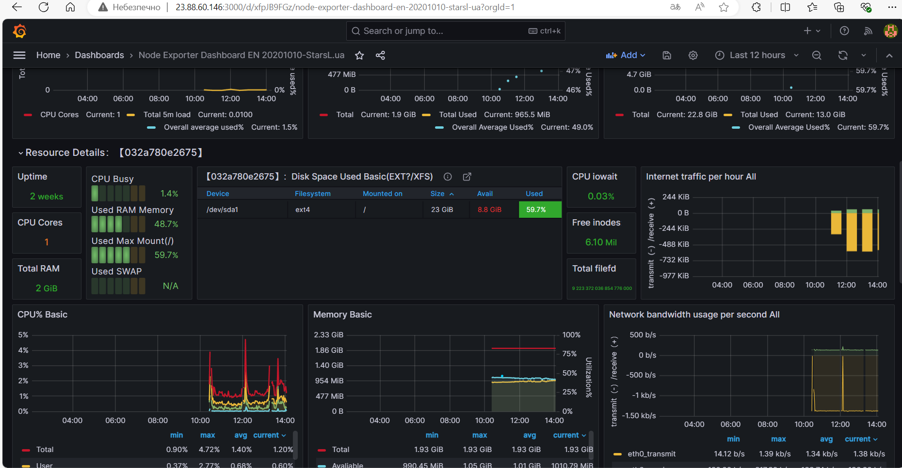

## Задум такий був
 
## Вміст папки loki

    prom_loki.sh: Скрипт для підйому Loki та Promtail.

    .env_loki: Зміни середовища для сервера LOKI, розглянемо їх:
        LOKI_PORT=: Порт на якому працює сервер LOKI. За замовчуванням - 3100.
        LOKI_LOG_LEVEL=: Рівень логування. За замовчуванням - info.
        LOKI_CONFIG_FILE=: Шлях до конфігураційного файлу всередині контейнера loki.
        LOKI_SERVER_HTTP_LISTEN_PORT=: Порт для прослуховування сервером LOKI. За замовчуванням - 3100.
        LOKI_TABLE_MANAGER_RETENTION_PERIOD=: Період зберігання даних у Loki. За замовчуванням - 24h.

    .env_promtail: Зміни середовища для сервера PROMTAIL, розглянемо їх:
        PROMTAIL_CONFIG_FILE=: Шлях до конфігураційного файлу всередині контейнера promtail.
        PROMTAIL_POSITIONS_FILE=: Вказівки файлу, в якому Promtail зберігає свої позиції.
        PROMTAIL_CLIENT_URL=: Шлях для передачі метрик.
        PROMTAIL_LOG_LEVEL=: Рівень логування. За замовчуванням - info.

    docker-compose.yml: Створюється скриптом. Містить звичайні властивості.

    loki-config.yml: Створюється скриптом. Містить конфігурацію для Loki, системи для агрегації та зберігання логів. У ньому визначаються параметри зберігання, індексації, обмеження та інші параметри.

    promtail-config.yml: Створюється скриптом. Містить конфігурацію для Promtail, агента для збору логів та відправки їх у Loki. У ньому визначаються джерела логів, етапи обробки та налаштування клієнта для відправки логів.


## Вміст папки promet

    prom.sh: Скрипт для підйому Prometheus та NODE_EXP.

    .env_node: Зміни для Node_Exporter, розглянемо їх:
        NODE_EXPORTER_WEB_LISTEN_ADDRESS=: Адреса для прослуховування сервером Node_Exporter. За замовчуванням - 0.0.0.0:9100.
        NODE_EXPORTER_LOG_LEVEL=: Рівень логування. За замовчуванням - info.
        NODE_EXPORTER_PATH_ROOTFS=/host
        NODE_EXPORTER_COLLECTOR_FILESYSTEM_ROOTFS=/host

    .env_pro: Зміни для Prometheus, розглянемо їх:
        PROMETHEUS_CONFIG_FILE=: Шлях до конфігураційного файлу всередині контейнера Prometheus.
        PROMETHEUS_STORAGE_TSDB_PATH=: Шлях до зберігання даних Prometheus.
        PROMETHEUS_WEB_ENABLE_LIFECYCLE=: Використовується для увімкнення веб-інтерфейсу керування життєвим циклом у Prometheus.
        PROMETHEUS_WEB_LISTEN_ADDRESS=: Адреса для прослуховування сервером Prometheus. За замовчуванням - 0.0.0.0:9090.
        ALERTMANAGER_IP=: Необхідно задати адресу де встановлено Alertmanager, можна вказати назву контейнера alertmanager, замість IP, якщо інше не передбачено.
        ALERTMANAGER_PORT=: Порт на якому працює сервер Alertmanager. За замовчуванням - 9093.
        LOKI_IP=: IP на якому працює сервер LOKI.
        LOKI_PORT=: Порт на якому працює сервер LOKI. За замовчуванням - 3100.
        NODE_EXP_IP=: IP на якому працює сервер, можна вказати назву контейнера node_exporter, замість IP, якщо інше не передбачено.
        NODE_EXP_PORT=: Порт на якому працює сервер Node_Exporter. За замовчуванням - 9100.
        PROMETHEUS_IP=: IP на якому працює сервер, можна вказати назву контейнера prometheus, замість IP, якщо інше не передбачено.
        PROMETHEUS_PORT=: Порт на якому працює сервер Prometheus. За замовчуванням - 9090.

    alerts.yml: Статичний файл, який не створюється скриптом. Містить правила, які визначають умови, за яких повинні спрацьовувати алерти.

    Dockerfile: Створюється скриптом. Містить інструкції для створення Docker-образу для деяких маніпуляцій з конфігураційними файлами.

    docker-compose.yml: Створюється скриптом. Містить звичайні властивості.

    entrypoint.sh: Створюється скриптом. Це скрипт, який виконується під час запуску Docker-контейнера.

    prometheus.yml.tpl: Створюється скриптом. Шаблонний файл конфігурації Prometheus, який містить змінні для динамічного налаштування.


## Вміст папки graf

    graf.sh: Скрипт для підйому Alertmanager та Grafana.

    .env: Зміни середовища, розглянемо їх:
        GF_SECURITY_ADMIN_PASSWORD=: Пароль для доступу до Grafana. За замовчуванням - admin.
        GF_INSTALL_PLUGINS=: Додаткові плагіни для встановлення в Grafana.
        GF_SERVER_HTTP_PORT=: Порт сервера Grafana.
        ALERTMANAGER_CONFIG_FILE=: Шлях до конфігураційного файлу всередині контейнера Alertmanager.
        ALERTMANAGER_LOG_LEVEL=: Рівень логування. За замовчуванням - info.
        ALERTMANAGER_PORT=: Порт підключення до Alertmanager.
        TELEGRAM_BOT_TOKEN=: Токен для Telegram-бота.
        TELEGRAM_CHAT_ID=: CHAT_ID до Telegram.
        PROMETHEUS_SERVE_IP=: Сервер де розгорнутий скрипт для підняття Prometheus.
        PROMETHEUS_SERVE_PORT=: Порт на якому працює сервер Prometheus. За замовчуванням - 9090.
        LOKI_SERVE_IP=: IP на якому працює сервер LOKI.
        LOKI_SERVE_PORT=: Порт на якому працює сервер LOKI. За замовчуванням - 3100.

    alertmanager.yml: Створюється скриптом. Містить конфігурацію для Alertmanager, який відповідає за обробку сповіщень. Він визначає правила маршрутизації сповіщень, налаштування отримувачів і глобальні параметри.

    dashboard-config.yml: Створюється скриптом. Містить конфігурацію для налаштування дашбордів Grafana автоматично при запуску.

    datasources.yml: Створюється скриптом. Містить конфігурацію джерел даних для Grafana. Це дозволяє Grafana знати, звідки брати дані для візуалізацій.

    docker-compose.yml: Створюється скриптом. Містить звичайні властивості.

    Підкаталог dashboards: Створюється скриптом.
        log-dashboard.json: Створюється скриптом. Це файл JSON, який визначає дашборд Grafana для відображення логів.
        Підкаталог imported: Створюється скриптом.
            11074.json: Створюється скриптом. Це файл JSON, який представляє конкретний дашборд для моніторинга, імпортований.


## Надсилання сповіщень про критичні логи, чи падіння сервера до телеграм боту:


## Встановлення:

### Перший крок

\```bash
git clone https://github.com/Amor19999/monitoring_script.git
sudo bash ./monitoring_script/loki/prom_loki.sh
sudo bash ./monitoring_script/promet/prom.sh
rm -fr graf
\```

На сервері, де буде розміщатися доступ до Grafana та система

### Другий крок

\```bash
git clone https://github.com/Amor19999/monitoring_script.git
sudo bash ./monitoring_script/graf.sh
rm -fr loki prome
\```

